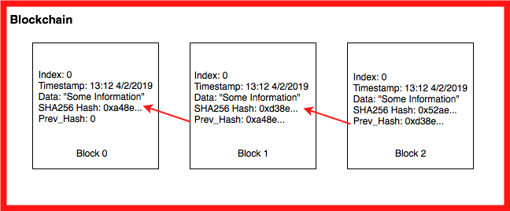

# Blockchain

A Blockchain is a sequential chain of records, similar to a linked list. Each block contains some information and how it is connected related to the other blocks in the chain. Each block contains a cryptographic hash of the previous block, a timestamp, and transaction data. For our blockchain we will be using a SHA-256 hash, the Greenwich Mean Time when the block was created, and text strings as the data.

Use your knowledge of linked lists and hashing to create a blockchain implementation.



We can break the blockchain down into three main parts.

First is the information hash:

```python
import hashlib

def calc_hash(self):
      sha = hashlib.sha256()

      hash_str = "We are going to encode this string of data!".encode('utf-8')

      sha.update(hash_str)

      return sha.hexdigest()
```

We do this for the information we want to store in the block chain such as transaction time, data, and information like the previous chain.

The next main component is the block on the blockchain:

```python
class Block:

    def __init__(self, timestamp, data, previous_hash):
      self.timestamp = timestamp
      self.data = data
      self.previous_hash = previous_hash
      self.hash = self.calc_hash()
```

Above is an example of attributes you could find in a `Block` class.

Finally you need to link all of this together in a block chain, which you will be doing by implementing it in a linked list. All of this will help you build up to a simple but full blockchain implementation!